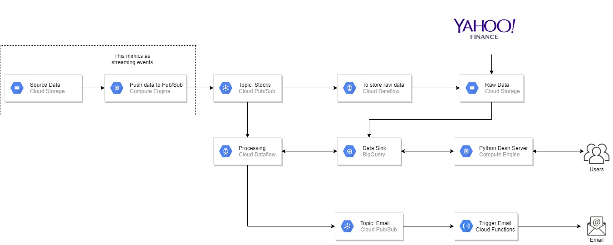

# Personal Stock Broker
Providing (near) Real-time Analytics on personal portfolio
## Table of Contents

1. [Motivation and Goal](README.md#motivation-and-goal)
2. [Data Description](README.md#data-description)
3. [Data Pipeline](README.md#data-pipeline)
4. [Demo](README.md#demo)
5. [Dashboard](README.md#dashboard)

### Motivation and Goal

A study by Federal Reserve Board in 2016 shows that almost 52% of the US families owned stocks either directly or as a part of a fund. Sometimes it is frustrating to miss on the stocks you are waiting for to invest in. So, my primary goal is to build a Stock Alert system to help an individual or a retail investor to understand which stocks are changing rapidly in his personal portfolio. It also helps him/her to decide on different BUY and SELL options.

### Data Description

I've considered approximately 2500 tickers for the project that are complied from famous stock market indices like S&P500, RUSSELL 1000, DOW JONES etc. I'm getting all my data from Yahoo Finance API. I have 2 types of data considered: Historic data and Real-time data. Historic data is a day-wise data and Real-time data is minute-by-minute data.

### Data Pipeline

-	Mocking the streaming events using existing data into Pub/Sub topic 'Stocks'
-	Storing the input stream of data in GCS bucket to persist the data
-	Used Cloud Dataflow to process the data from Cloud Pub/Sub and by retrieving information from different tables in Big Query
-	Deployed Flask App which has Python Dash dashboards for the frontend to monitor different stock metrics
-	Created another topic ‘Emails’ in Cloud Pub/Sub which triggers Cloud Functions that sends an email alert to user

### Demo

[Here](https://docs.google.com/presentation/d/1acv_u0muEB_9jies7HtEDo5v2bTV3LYizrKRVRtfZFk/edit?usp=sharing) you can see the demo of my application and know how it works.

### Dashboard

I've built the frontend using Python Dash with Dash core and html components along with CSS styling. Based on the list of tickers user provided and the threshold the user chose, an email alert will be triggered using Amazon SES after checking if the input set of tickers are valid.

### Contact Information

- [srujankumar.majeti@gmail.com](srujankumar.majeti@gmail.com)
